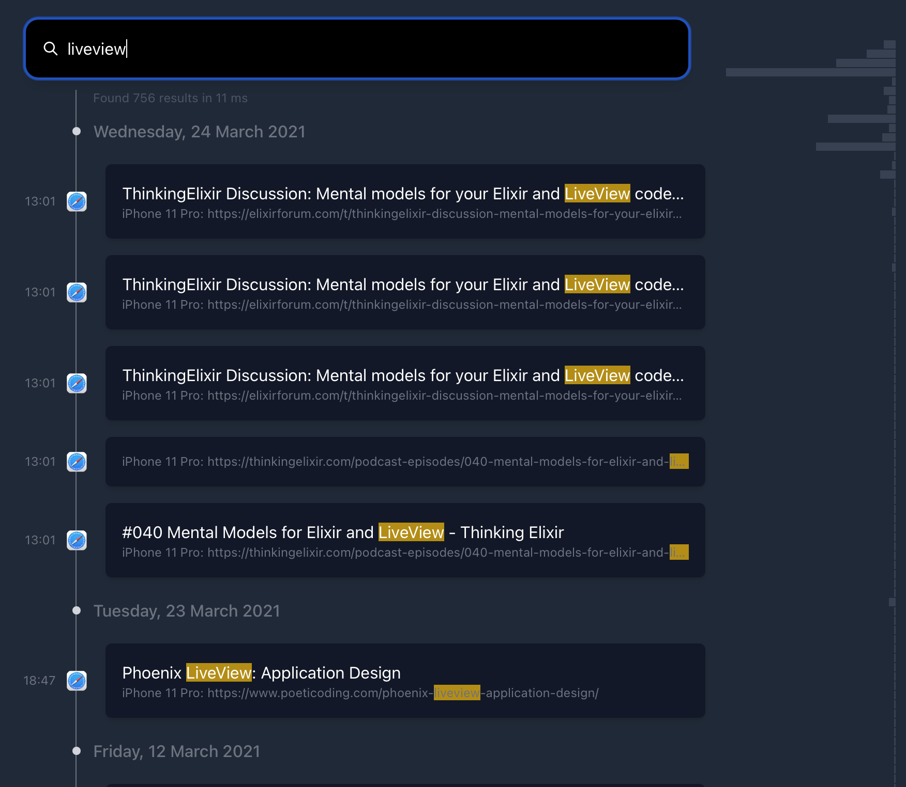

Inspired by the [talk Building a Memex](https://www.youtube.com/watch?v=DFWxvQn4cf8&t=1616s) by Andrew Louis I've started a side project like this.

The idea is to record everything I do. Similar to the quantified self movement where as much data as possible is collected. However the idea is to build a tool to remind myself of things I did and learned in the past instead of focusing on the data visualization part. The [[Notes database]] is a subset of this idea.

Andrew has written many interesting [blog posts](https://hyfen.net/memex/) while building a memex.  

### Memex UI
The code is on github: https://github.com/adri/memex.
Tech is Elixir, Phoenix Liveview, Tailwind CSS, Meilisearch, SQLite, JQ


- [x] Infinite scroll
- [x] Date facet adds filters
- [x] Hover over facets and click to select date
- [x] Search facet:value filters on facets instead of filter condition
- [x] Automatically grow search field (fixed by making it bigger)
- [x] Show surrounding 
- [ ] Autocomplete to add filters 
- [ ] Disable typo correction 

### Data types
- Websites I browsed (Safari) ✅
- CLI commands I ran (Terminal) ✅
- Repositories I starred (Github) ✅
- People I message with (via iMessage) ✅
- Payments I made (MoneyMoney) ✅
- Photos I took (Photos app) ✅
- Youtube videos I watched (via Safari) ✅
- Tweets I read (Twitter) ✅
- Notes I wrote (Github) ✅
- Website content I saved (Instapaper?) https://github.com/postlight/mercury-parser
- Places I visited (Arc?)
- Issues I opened or closed (Github)
- Pull requests I created (Github)
- Commits I made (local git) 
- People I met (Calendar?)
- Songs I listened to (Music)
- Slack messages I wrote (Slack https://github.com/AlekseyDurachenko/slack2sqlite)
- Songs I listened to. Maybe with Applescript?
    ```applescript
    tell application "Music"
        set recently_played to (tracks of playlist "Recently Played")
        set output to ""

        repeat with r in recently_played
            --		set id to "database ID" of r
            set track_name to name of r
            set track_artist to the artist of r
            set track_album to the album of r
            set track_duration to (get duration of r)
            set played_date to (get played date of r)
            set played_count to (get played count of r)
            set skipped_date to (get skipped count of r)
            set skipped_count to (get skipped count of r)

            set output to (output & "{'artist':'" & track_artist & "', 'track': '" & track_name & "', 'album':'" & track_album & "', 'duration': '" & track_duration & "', 'played_date': '" & played_date & "', 'played_count': '" & played_count & "'}
    ")

        end repeat
        copy output to stdout
    end tell
    ```
- Podcasts I listened to 
    ```bash
    sqlite3 ~/Library/Group\ Containers/243LU875E5.groups.com.apple.podcasts/Documents/MTLibrary.sqlite
    ```
     Example SQL:
        
    ```sql
        SELECT
            ZMTEPISODE.ZUUID AS episode_uuid,
            ZMTPODCAST.ZTITLE AS podcast_title,
            ZMTEPISODE.ZTITLE AS episode_title,
            ZMTEPISODE.ZITEMDESCRIPTIONWITHOUTHTML AS episode_description,
            datetime (ZMTEPISODE.ZLASTDATEPLAYED + 978307200,
                    "unixepoch",
                    "utc") AS last_played,
            ZMTEPISODE.ZPLAYCOUNT as play_count
        FROM
            ZMTEPISODE
            LEFT JOIN ZMTPODCAST ON ZMTEPISODE.ZPODCAST = ZMTPODCAST.Z_PK;
     ```

### Choosing the right format
The most future proof format for data is **plain text**. For example in the form of JSON, CSV, Markdown, YAML and so on. Technology changes fast, databases come and go. The source of truth should always be plain text, so that the data is available for many years. Loading data into a database is fine, as long as the source format is plain text. 

### Data is short lived
Most links or images on the internet don't work anymore after a few years. To combat this:
- use archive.org to get back to a certain link
- store every visit 

### Future: Creating links between documents
Computers get smarter and can create links between documents that humans can't see because of the large amount of data. A lot of informational value comes not just from the documents themselves but from the metadata about the document.

- Metadata of images with OCR text and AI recognized entities like [[Google Cloud AI Vision API]]
- Metadata of notes with AI detected named entities like [[Google Natural Language API]]
- Metadata of videos with generated captions
- Metadata of websites from SEO content or crawlers, for example:
    - Participants of a meetup I joined
    - Languages used in a Github project I liked
- Metadata of payments with detected shops

### Inspiration 
- https://www.algolia.com/doc/guides	/building-search-ui/resources/ui-and-ux-patterns/in-depth/query-suggestions/js/
- https://github.com/jshjohnson/Choices
- https://tailwind.build/#how-it-works
- timeline https://codepen.io/russelllighthouse/pen/pRXyqW
- timeline https://codepen.io/mathiesjanssen/pen/ggeBKmr

### Sources
- [The original 1945 Memex essay](https://www.theatlantic.com/magazine/archive/1945/07/as-we-may-think/303881/)
- [Building a Memex blog](https://hyfen.net/memex)

#published 