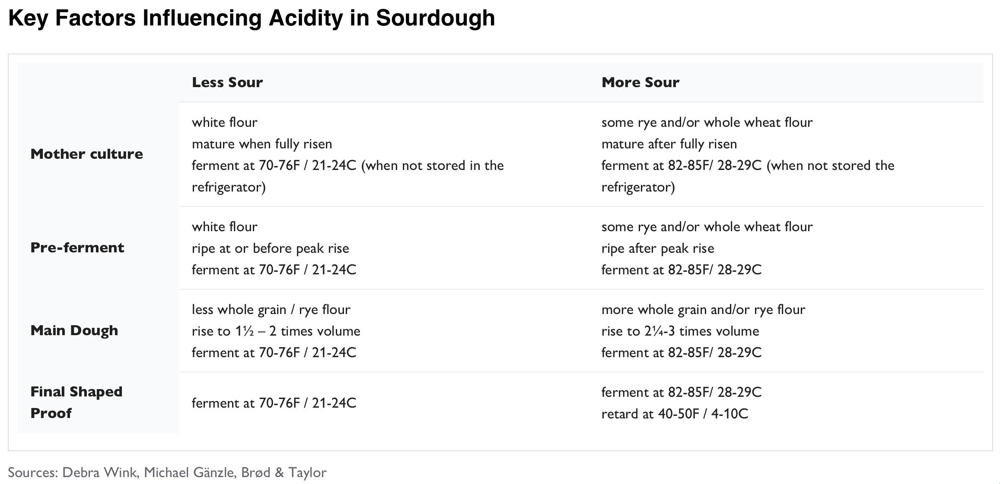
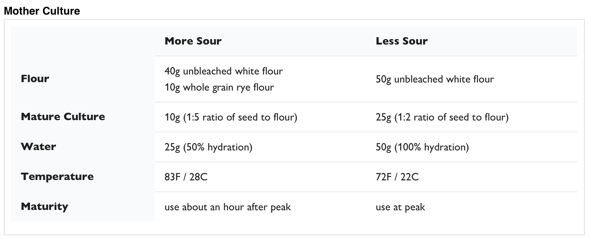

### Key factors
1. Maturity: more acid producers (LAB) means more sour
2. Temperature: higher temperature means more sour
3. Type of flour: more whole grain or rye means more sour

## Mother Culture
The balance between yeast and lactobacilli (LAB) influences the sourness. More LAB means more acid producers, so a more sour bread.

When feeding the motherdough, influence the balance with: 
* **Less sour**: 22C, white flour, 1:5 ratio of motherdough vs flour, use at peak maturity
* **More sour**: 29C, <20% rye flour, 1:2 ratio of motherdough vs flour, use after peak maturity

### Maturity
Maturity is about when to use the mother culture for the dough. A motherdough should be active when used for baking. Use it at it's peak rise for less sourness, or let it shrink again to develop more LAB and increase sourness.

### Sources
1. [Brod and Taylor Part 1](https://brodandtaylor.com/blogs/recipes/make-sourdough-more-sour)
2. [Brod and Taylor Part 2](https://brodandtaylor.com/blogs/recipes/make-sourdough-more-or-less-sour-part-2)

#published 