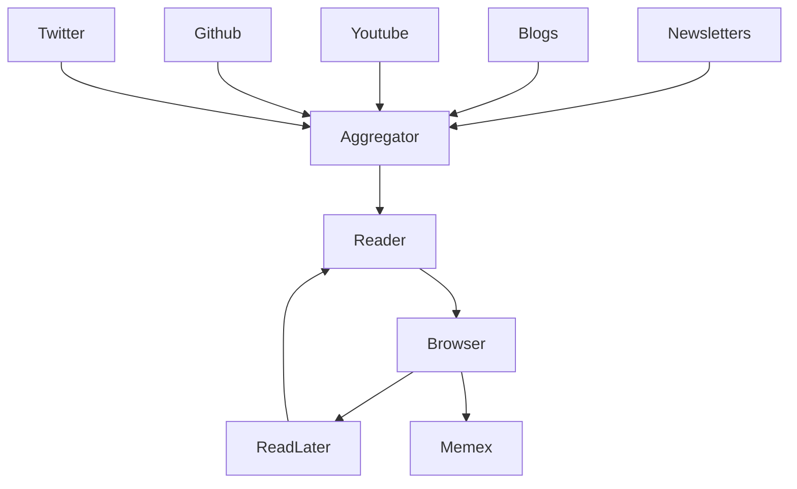

Reading news is fun, inspires and gets me excited. I get a lot of energy from learning. However, there is a downside to reading news. With information becoming very cheap to produce, it becomes harder to manage my attention, see the [[Impact of reading news]].

### News
For me, news is information about events that happened in topics I care about. My criteria for good news are:
- On topic (mostly tech stuff)
- Well researched, based on facts with sources
 
What "kind" of news I don't like basically describes the "mainstream" news that focus on being clickbait, based on emotions, suspense or urgency.

### Sources
To get the news I like to read, I need to be careful about what sources I select.

- **Weekly newsletters**
  Newsletters aggreate news about specific topics on a weekly basis. This reduces my daily attention and acts as a pre-filter. However using email as a medium for news doesn't work for me, which is why I integrate them into my news feed via **RSS**.
  Examples are:
	- [Weekly SRE](https://sreweekly.com): What's happening in software development, ops, platforms and tools.
	- [DB Weekly](https://dbweekly.com): A weekly round-up of database technology.
	- [Weekly StatusCode](https://weekly.statuscode.com)
	- [Mobile Dev Weekly](https://mobiledevweekly.com)
	- [HackerNews weekly](https://us1.campaign-archive.com/feed?u=faa8eb4ef3a111cef92c4f3d4&id=e505c88a2e)
- **Selected blogs**
   Some blogs consistently provide high quality content.
	- [Increment](https://increment.com)
	- [Slack Engineering](https://slack.engineering)
	- [Zalando Engineering](https://engineering.zalando.com)
- **Selected YouTube Channels**
  Being unhappy with the recommendations on YouTube, I selected some channels that I find interesting and added them to the news feed.  
- **Personal GitHub Feed**
  A RSS feed of changes to Github repositories or by users I follow. `https://github.com/[user].private.atom?token=[token]`
- **Read later**
  Currently I use Instapaper to save news that I like to read later. Once a week Instapaper sends a list of saved news to my Kindle. However this system doesn't work well as I hardly ever read the news on the Kindle. I need to find another solution.
- **Twitter**
  This source is still "WIP". I follow many people, but many of the tweets are not relevant.

### Destinations
- **Memex**
  I'm [[Building a Memex]] which stores things I did. When I open news in the browser they end up in the Memex.
- **Highlights from Kindle or websites**
  No good solution yet.

### News Flow
Currently I use [Feedly](https://feedly.com) as a news **aggregator**. The advantage of having a central place are that the read/unread state is synchronized across devices.

For **reading** I use [ReadKit](https://readkitapp.com), mostly on iOS and sometimes on macOS. It has a great "reader" feature which downloads news (e.g. blog post) and shows only relevant text and images without cookie banners and ads.

#published
 