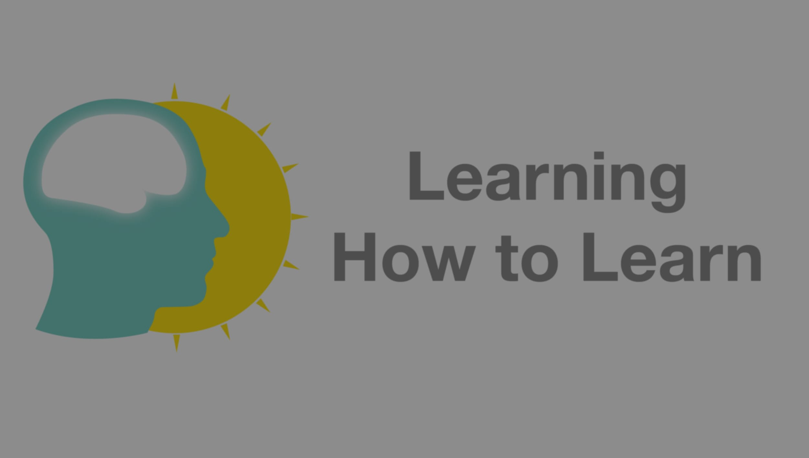
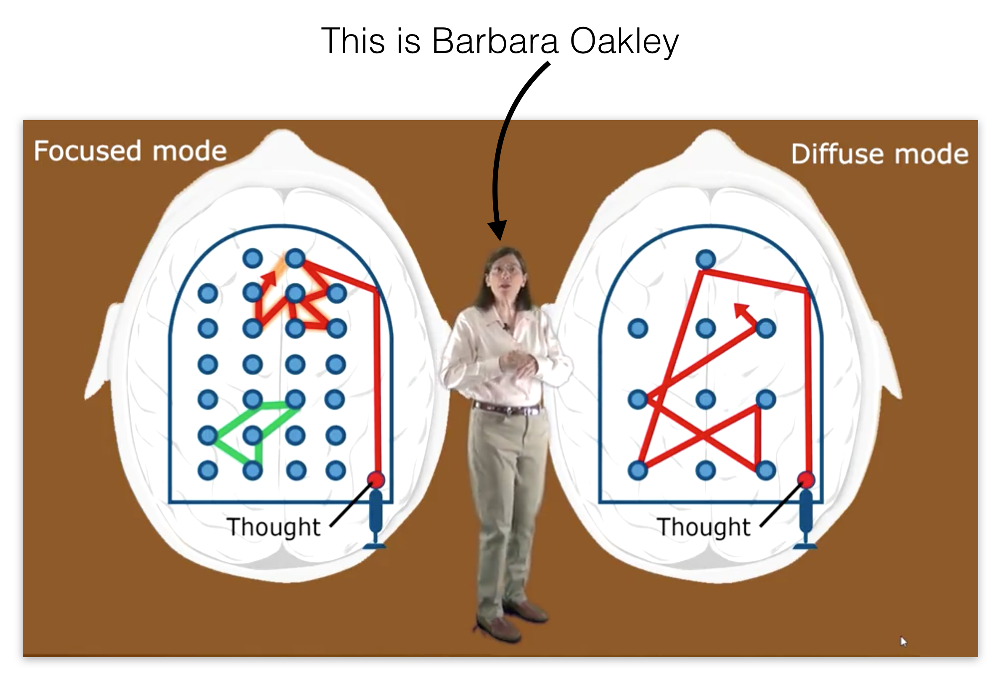

I love learning new things. I get a lot of energy from it. Too bad that I also forget stuff. Why is it that I remember some things well and some things less? Is there a wrong way to learn? How can I **improve my learning skills**?

With these questions on my mind I did the online course [Learning How to Learn: Powerful mental tools to help you master tough subjects](https://www.coursera.org/learn/learning-how-to-learn/) taught by Barbara Oakley and Terrence Sejnowski at end of last year. I have to say, it turned out to be **one of the best online courses** I did.

Source: [Learning How to Learn](https://www.coursera.org/learn/learning-how-to-learn/).

Here are my course notes.

# _Week 1_

### Modes

1. **Focused**: Logical thinking, using existing thoughts.
2. **Diffuse**: Creative thinking, making new thoughts.

Source: [Learning How to Learn](https://www.coursera.org/learn/learning-how-to-learn/).

### Abstract things

The more abstract something is the more important practice is to make neuronal connections in the brain.

### Memory models

- working memory: small, fast access.
- long term memory: big, slow access.

…and others.

### To make stronger neuronal connections

1. **Over time**: To get something from the working memory to the long term memory it takes time and practice. Learning should be spread over time, with pauses in between.
2. **Sleep**: Especially when wanting to dream about it.

### Tips to get to the diffuse mode

1. **Exercise**: Take notes immediately to not forget.
2. **Environment**: Get involved with other people, not by yourself. Rubberducking.

# _Week 2_

### Chunking

Chunking is combining bits of information together with a meaning.

Chunking helps the brain to run more efficiently by remembering the main idea. Just memorising a fact without the context doesn’t help to understand.

Focusing, practicing and repetition help to build chunks.
The best chunks are always available to remember.

Examples can help to quicker understand an idea. Like hearing a song when you want to learn it on the guitar.
Too much focusing on one single step can also be dangerous not see the connections between steps.

### Steps of forming a chunk

1. Focus without distraction.
2. Figure out the main idea by using both modes/
3. Practice:
   - Ensure accessibility of the chunk.
   - Doing it yourself to validate the idea.

### Context

- **Bottom up**: Chunking, practice and repetition. “How to do”.
- **Top down**: Getting the big picture. “When to use”.
- **Context**: Combines the two.

### Tips

1. Learn the main concepts first, the structure.
2. Then fill in the details.
3. **Recalling**, remembering the key ideas is efficient. Retrieving information helps learning. Recalling outside of the usual environment help to become independent of environment. _Rereading_ or spending a lot of time doesn’t help as much.
4. Testing yourself and making mistakes can help to correct thinking.
5. Transfer: Linking one concept in another field.

### Motivation

Importance and value of the material in the future.

### Acids

- Acetylcholine: focused learning, form connections, long term memory
- Dopamine: controls motivation, released when unexpected reward, promised reward
- Serotonin: Social life, risk taking behaviour
- Emotions: Slower than action/response

### Reasoning

1. **Sequential**: Step by step reasoning. Focused mode.
2. **Holistic**: Intuition, build new links. Diffuse mode. Verify outcomes with focused mode!

### Law of Serendipity

If there is a lot of material, just start somewhere. The rest will get easier.

### Overlearning

Continuous practice after mastering something. Can be valuable for automating things in times of nervousness.

### Deliberate practice

Focusing on the difficult parts of the material.

### Einstellung

Initial intuition can be misleading. Unlearning old ideas while learning new ones.

### Interleaving

Select and use different chunks to learn how to switch between them. Build flexibility.

- Getting used to learning not only how a technique works but also when to use it.
- Make connections between chunks in different fields.

# _Week 3_

### Procrastination

A bad habit, often with making irrational excuses. Flow:

1. Unhappy feeling with a task (pain).
2. Doing more enjoyable things.
3. Feeling better temporarily .

### Habits

Building strong chunks to not focus anymore on everything. Good and bad. Flow:

1. **Cue**: Trigger to start a habit.
2. **Habit**: Reaction.
3. **Reward**
4. **Belief**: Underlying belief.

To change a habit you have to change the underlying belief.

### Negative feelings

Negative thinking at the start is normal. Good learners don’t waste time and get started.

### Focus on the process

To avoid procrastination it is good to focus on the **process**, like spend 20 minutes on a topic instead of the **outcome**, e.g. finishing a test. Most unhappy feelings or pain come from focusing on the outcome.

- Learning starts earlier, not e.g. a day before a test.
- There is more repetition because it becomes a habit to learn a bit more often.

### Changing habits

1. **Trigger**: Only changing the cue or trigger should need willpower to change.
   A trigger can be:
   - Location
   - Time
   - Feeling
   - Reactions
2. **Plan B**: To avoid going in old habits, have a plan B to avoid the reaction.
3. **Reward**
4. **Belief**: Belief that the new system works.

### Visual memory

Works very well. To get working memory to long-term memory using images:

1. Idea must be memorable.
2. Repetition.

Use more senses like smelling or hearing to make the memory stronger.

### Hippocampus

Stores new memories in the cortex.

### Consolidation and Reconciliation

- **Consolidation**: Storing memories in the long term storage
- **Reactivation**: Recalling a memory. The memory is in a new context.
- **Reconciliation**: When recalling, memories change which can be stored again.

Consolidation and reconsolidating occur during sleeping.

### Astrocytes

- Provides nutrients to neurons
- Maintains extra cellular ion balance
- Involved in repairing brain injury

### Memory palace

Technique to visualise where something you have to remember is placed. Used to remember lists of not related things.

# _Week 4_

### Learning doesn't progress logically

Temporarily feeling like taking a step back in learning is ok because the mind is restructuring its understanding.

### Analogies

Help to get people out of _Einstellung_.
Stories help to remember things.

### Hemispheres

- **Left**: interprets the world. keeps interpretations unchanging.
- **Right**: questions the status quo, looks for global inconsistencies

Verify your solutions in the global sense. Does this really make sense?

## Others

study with friends
explaining to friends
also good for career building

## Changing life

Changing thoughts can change life. Practicing neuronal patterns.

## Testing checklist

More effective than studying. What helps:

- Did you make a serious effort to understand the text?
- Did you work with classmates on homework problems?
- Did you attempt to outline every homework problem solution?
- Did you participate actively in homework group discussions?
- Did you consult with the instructor?
- Did you understood all of your homework problem solutions?
- Did you ask in class for explanations of homework problem solutions that weren’t clear to you?
- Did you have a study guide?
- Did you attempt to outline lots of problem solutions quickly?
- Did you attend a review session?

## Start with hard, switch to easy

Start with difficult problems, then go to easy problems. Must have discipline to switch from the hard problem to another task.
