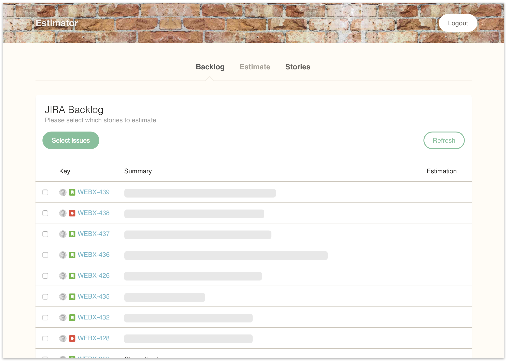

I believe that to really learn a programming language, I have to get involved in a project. [Getting an overview of the Elixir language](/post/why-elixir-has-great-potential) was great. But to be able to learn about the details of Elixir and its ecosystem I needed a side-project.


Like many developers who want to learn a new technology, I searched for a problem to solve. 

> If all you have is a hammer, everything looks like a nail.  
> [Abraham Maslow](https://en.wikipedia.org/wiki/Abraham_Maslow)

I had to find a nail for this new hammer. Luckily there was a need at [my work](https://www.ticketswap.com) for a planning poker tool that is integrated with Jira and works well with remote developers. 

### Estimations for Remote Teams
[Planning poker](https://en.wikipedia.org/wiki/Planning_poker) is a estimation technique used in agile software development. Usually this is done with physical paper cards. In a remote-friendly environment, physical cards are not always useful. 

  
[Source: Wikipedia](https://en.wikipedia.org/wiki/Planning_poker#/media/File:CrispPlanningPokerDeck.jpg)

At work we used the web-based tool [PlanITpoker](http://www.planitpoker.com) for a while but we missed an integration with Jira, our issue tracker.  We also had some issues with people joining twice, when using the tool at the same time on the phone and on the notebook. 

To me this sounded like a nice challenge for learning Elixir. The challange involved **presence detection** of team members, **synchronising estimations** and **using external APIs**. I found my nail!

### The Plan
Everything was geared towards the specific use-case we have. Learning Elixir was the focus, the product was secondary. I wanted to implement the following functionality.

1. Import stories from Jira.
2. Estimate. This involves estimations by the team members and a moderator handling those.
3. Saving estimations as "story points" in Jira.

### How does it look like?
I wanted to spend as little time as possible on the user interface. This meant for me using a [template](https://www.creative-tim.com/product/paper-kit) and hacking the needed Javascript. This is how step 1 "Import stories from Jira" looks like:



Step 2 "Estimate" and step 3 "Saving estimations in Jira" is best shown in a short video. Here you can see an estimation of one story from the perspective of a moderator:

<div class="video-container"><iframe width="560" height="315" src="https://www.youtube.com/embed/uEaGnlmUaWE" frameborder="0" allowfullscreen></iframe></div>

The video shows: The moderator has selected a story to estimate. All team members see the same story description. Team members are giving their estimation by choosing a card for the estimated effort: XS, S, M, L or XL. When all team members have given their estimation, the results are shown and the moderator can save an estimation.

### What I learned so far
Learning a new language through a side-project works well for me. I get energy from learning and it is motivating to create something useful. 

The complete source code can be found [on Github](https://github.com/adri/estimator-elixir). 

**Jira API**
[HTTPoison](https://github.com/edgurgel/httpoison) makes creating API clients in Elixir easier. I like the concept of using adapters to external APIs. Using [`HTTPoison.Base`](https://github.com/edgurgel/httpoison#wrapping-httpoisonbase) allows this in a concise manner. An example:

```elixir
defmodule Jira.API do
  use HTTPoison.Base
 
  def process_url(url) do
    Application.get_env(:jira, :host) <> url
  end
  
  def process_response_body(body) do
    Poison.decode!(body)
  end
  
  def backlog(board_id) when is_integer(board_id) do
    get!("/rest/agile/1.0/board/#{board_id}/backlog").body
  end
end
```

Using `Jira.API.backlog/1` returns the response of the `/rest/agile/1.0/board/#{board_id}/backlog` endpoint. The `backlog` function is then used in the rest of the code. This allows easy mocking in automated tests.

**Caching**
To not overload the Jira API with unnecessary requests I wanted to cache the backlog and allow users to invalidate this cache if needed. I made this work by using the library [`con_cache`](https://github.com/sasa1977/con_cache). 


The implementation was surprisingly concise:

```elixir
def backlog(board_id) do
  ConCache.get_or_store(:jira_backlog, board_id, fn() -> API.backlog(board_id) end)
end

def invalidate_backlog(board_id) do
  ConCache.delete(:jira_backlog, board_id)
end
```

When working with NodeJS or PHP I would have eventually used Redis or Memcached for this. Thanks to using [ETS (Erlang Term Storage)](http://erlang.org/doc/man/ets.html) under the hood, `con_cache` is already a good enough implementation.

**Phoenix Presence**

Team&nbsp;members should be able to join and leave an estimation session. The state of team members should be synchronised across devices. [Phoenix Presence](https://hexdocs.pm/phoenix/Phoenix.Presence.html) was a perfect tool for this.

Implementing Presence was straight forward. There are [many examples](https://www.google.com/search?q=phoenix+presence+example) available. Doing presence detection with NodeJS would be totally possible. What makes Phoenix Presence so [special](https://dockyard.com/blog/2016/03/25/what-makes-phoenix-presence-special-sneak-peek) is that it synchronises presence information between multiple Erlang nodes automatically, without a central data store and with strong eventual consistency (CRDT). 

**Phoenix Channels**
During estimation sessions I wanted to have all information synchronised between team members. When a moderator selects a story to estimate, the description of the story should be shown for every team member. When a team member votes, it should be visible immediately.

I used [socket.io](https://socket.io) for soft-realtime communication in other projects before. Programming with Phoenix Channels felt very similar to that. The [Phoenix documentation](http://www.phoenixframework.org/docs/channels) has a great walkthrough how to implement Phoenix Channels.

In following example of a new vote coming in, I store the vote and then broadcast the new vote to all other team members.

```elixir
def handle_in("vote:new", message, socket) do
  {:ok, vote} = Votes.insert_vote(%{
    topic: socket.topic,
    user_id: socket.assigns.user["id"],
    issue_key: message["issue_key"],
    vote: message["vote"],
  })

  broadcast! socket, "vote:new", VoteView.render("vote.json", vote)

  {:noreply, socket}
end
```


**GitHub login**
For logging in team members I used Github. This had the added benefit of having an avatar and a name. After a bit of research I found [`ueberauth`](https://github.com/ueberauth/ueberauth) and [`ueberauth_github`](https://github.com/ueberauth/ueberauth_github). 
    
I had some troubles understanding how to use the library. When I found out how to [implement the auth callbacks](https://github.com/adri/estimator-elixir/blob/1d1eb74ce464a359b089f095f09bf49f41b426ea/lib/estimator/web/controllers/auth_controller.ex#L20) it went well. 

**Deployment**
For me it was the first time using Heroku. I like that Heroku provides a free plan for side-projects. Following the [instructions in the Phoenix documentation](http://www.phoenixframework.org/docs/heroku) got my Elixir app deployed in no time and without hassle. I have also setup the [Github integration](https://devcenter.heroku.com/articles/github-integration) to auto-deploy when pushing to the `master` branch.

### What's next?
Using Elixir has been fun. I'm far from being done learning about it. My ideas what to look into:

- Explore how to do automated testing
- Refactor the Elixir code 
	- Think about code structure and runtime concerns. The article [to spawn, or not to spawn?](http://theerlangelist.com/article/spawn_or_not) by Saša Jurić is a great resource 
	- Use [Credo](https://github.com/rrrene/credo), a static code analyzer
- Try [Absinthe](http://absinthe-graphql.org) (GraphQL) with subscriptions
- Try adding optional types and check them via [dialyxir](https://github.com/jeremyjh/dialyxir)
- CI setup 
- Refactor the frontend using React (maybe)

The complete source code can be found [on Github](https://github.com/adri/estimator-elixir). 